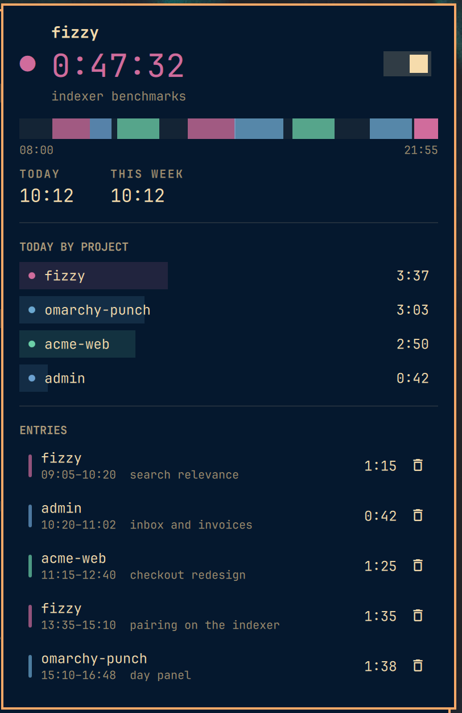

# Punch

Time tracking for [Omarchy](https://omarchy.org), built for the case that
actually happens forty times a day: you switch what you are working on and you
do not want to think about the tracker.

The bar pill is not a launcher for a timer. It **is** the timer — the project
and the running clock, in that project's color, so "what am I on and for how
long" costs a glance and no clicks. Starting the clock
on the thing you were doing an hour ago is one keypress; starting it on
something new is a keypress and a few letters.


Running and stopped: the pill carries the project and the clock while it runs,
and collapses to a quiet glyph when it does not.

## Install

Punch is one plugin wearing three hats. The **service** owns the clock, the
**bar widget** renders it, and the **overlay** is the quick switcher, so the
running entry survives a panel closing, a bar reload, or a monitor appearing.

```bash
omarchy plugin add https://github.com/peterberkenbosch/omarchy-punch.git --enable --yes
ln -sf ~/.config/omarchy/plugins/pb.punch/bin/punch ~/.local/bin/punch
```

Or, working on a local checkout:

```bash
git clone git@github.com:peterberkenbosch/omarchy-punch.git ~/.config/omarchy/plugins/pb.punch
omarchy-shell shell rescanPlugins
omarchy plugin enable pb.punch --section right
```

Then two keybindings in `~/.config/hypr/bindings.lua`. `SUPER+T` is Omarchy's
float toggle, so Punch sits beside it:

```lua
o.bind("SUPER + SHIFT + T", "Punch: start/stop", "punch toggle")
o.bind("SUPER + ALT + T", "Punch: switch project", "punch pick")
```

## Uninstall

```bash
omarchy plugin remove pb.punch --yes
rm -f ~/.local/bin/punch
```

Then drop the two keybindings from `bindings.lua`. Your time log is left alone;
delete it yourself if you want it gone:

```bash
rm -rf ~/.local/share/punch ~/.config/punch
```

## The pill

Stopped, it is a quiet glyph. Running, it becomes a pill in the project's color
carrying the name and the elapsed time.

| Interaction | What it does |
|---|---|
| left | open the day panel |
| right | stop, or resume the last project if stopped |
| middle | open the quick switcher |
| scroll | walk recent projects **without** stopping the clock |

## The quick switcher

`SUPER+ALT+T`. One input, no chrome. Type enough of a project to tell it apart
and press enter. A name that matches nothing offers to create it, so there is no
separate "new project" step.

The typed line is the whole grammar:

```
acme                        start acme now
acme: pairing on the bar    start acme with a note
acme +45                    start acme as if it began 45 minutes ago
acme +45: writing the spec  both
: reviewing the migration   note this on whatever is already running
```

A line that is nothing but a note says something about the work in progress
rather than starting new work, so the same keybind that switches projects is
also how you describe the one you are on.

`+45` rather than a bare `45` so a project legitimately named `sprint 45` stays
typeable. A backdate can never reach behind the last logged entry — Punch clips
it to that boundary and says so, rather than quietly double-billing the overlap.

## The day panel



Left-click the pill. Under the clock is the note on the running entry, and every
finished row carries one too: click the line, or press `d`, and it becomes a
field. `enter` saves, `esc` discards, clicking away saves.

The note is the description Moneybird may print on an invoice, so it is worth
writing while the work is fresh rather than only in the second the clock starts,
which is the one moment you have nothing to say yet — and worth fixing later,
when you remember what the work actually was.

The strip across the top is the shape of the day, one band
per project, gaps shown as gaps so you can see what you failed to track. Below
it: today and this week, per-project totals, and the day's entries with the
running stretch sitting in the list like any other row.

| Key | |
|---|---|
| `enter` | resume the selected row's project |
| `d` | write the note on the selected entry, or the running one |
| `s` | start / stop |
| `p` | quick switcher |
| `+` / `-` | lengthen or shorten the selected entry by 5 minutes |
| `x` | delete the selected entry |
| `j` `k` / arrows | move |
| `esc` | close |

## The CLI

Every subcommand is one IPC call into the running shell, so the terminal and the
pill are never two copies of the truth.

```
punch                     what is running right now
punch start [text]        start (defaults to the last project; takes the grammar above)
punch stop
punch toggle
punch note [text]         set the note on the running entry (empty clears it)
punch discard             drop the running entry without logging it
punch trim <minutes>      cut the last N minutes off the running entry
punch next | prev         walk recent projects
punch today
punch week
punch csv [YYYY-MM-DD]    finished entries as CSV
punch projects
punch pick                open the quick switcher
punch panel               open the day panel
```

That makes the tracker scriptable. A direnv-style hook that starts the right
project when you `cd` into a client repo is a couple of lines on top of
`punch start`.

## Idle

The shell already knows when you walk away. Come back after fifteen idle minutes
with the clock still running and Punch raises one notification: clicking it
trims the away time off the entry and picks it straight back up, doing nothing
keeps it. Punch never edits the log on its own — whether lunch counts is a
judgement call, so it asks.

Set `idleThresholdSec` to `0` to turn it off.

## Moneybird

Finished entries can be pushed to [Moneybird](https://www.moneybird.com) through
its official CLI. Stopping the clock sends the entry; anything that fails
because you were offline or your token expired stays queued and is retried with
a widening backoff, so the log on disk is always the truth and Moneybird catches
up to it.

Install [moneybird-cli](https://github.com/moneybird/moneybird-cli) following
its own README (a manual route without the installer is in
[docs/moneybird.md](docs/moneybird.md)), then log in:

```bash
moneybird-cli login <token>       # scopes: time_entries, sales_invoices, settings
```

Then set `moneybirdSync` to `true` on the Punch entry in `shell.json`, and map
your projects in `~/.config/punch/moneybird.json`:

```json
{
  "defaultBillable": true,
  "projects": {
    "admin":    { "billable": false, "project": null },
    "acme-web": { "project": "Acme website", "contact": "Acme Corp" }
  }
}
```

A Punch project with no entry here is matched against your Moneybird projects by
name, so calling one `fizzy` on both sides needs no configuration at all. One
that matches nothing and is not mapped is **refused, not guessed** — booking it
anyway would put billable time against no project, which is the kind of thing
you find out about on an invoice.

```bash
punch sync                  # push anything not yet in Moneybird
punch sync status           # how far behind the push is
punch-moneybird doctor      # login, resolved user, and your Moneybird projects
```

The day panel shows `n entries waiting to sync` while there is a backlog, and
puts a tick on every row that has reached Moneybird.

Entries are only ever **created** — editing or deleting one after it has synced
does not propagate.

**[Full setup, mapping reference, and troubleshooting →](docs/moneybird.md)**

## Settings

Inline on the bar entry in `~/.config/omarchy/shell.json`:

```json
{ "id": "pb.punch", "idleThresholdSec": 900, "roundToMinutes": 15, "showProjectName": true, "hideWhenStopped": false }
```

| Key | Default | |
|---|---|---|
| `idleThresholdSec` | `900` | ask about idle time after this long; `0` disables |
| `roundToMinutes` | `0` | round finished entries **up** to the next N minutes |
| `moneybirdSync` | `false` | push finished entries to Moneybird (see above) |
| `showProjectName` | `true` | show the project name in the bar, not just the time |
| `hideWhenStopped` | `false` | hide the pill entirely when nothing is running |

Rounding applies when an entry stops, never to the live timer: what you watch is
real time, what lands in the log is billable time.

## Data

```
~/.local/share/punch/state.json     what is running now, plus known projects
~/.local/share/punch/entries.jsonl  one JSON object per finished entry
```

Line-oriented on purpose, so the log stays greppable, diffable, and repairable
without the shell. An entry that crosses midnight is stored once and clipped
into both days when it is read, never counted twice.

## Hacking on it

Omarchy watches `~/.config/omarchy/plugins/` and reloads plugin code on save,
but in practice that did not swap either the service or the bar widget here:
the old service kept the `punch` IPC target, and the widget kept its old
component. **Run `omarchy restart shell` after editing any QML in this plugin**,
or you will spend a while debugging code that is not running.

`Model.js` is Qt-free so the arithmetic that decides what gets billed can be
checked without a compositor:

```bash
node test/model-test.js
```

## Not in this version

- No Toggl or Harvest sync. Moneybird is the one backend so far; the shape it
  uses — a script the service shells out to — is where another would hang.
- No pause on lock. Idle detection covers the real case.
- Entries are edited in 5-minute steps, not by dragging their edges.

## License

MIT.
